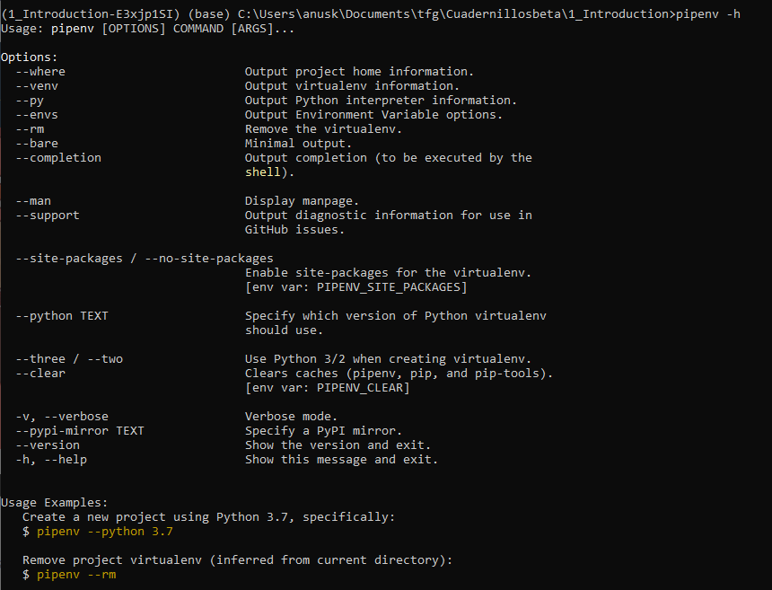

# How to use Pipenv as an enviroment for TDI exercises

## What is pipenv?

Pipenv is a packaging tool for Python that helps to create a virtual enviroment (virtualenv) for a project. It simplyfies the handling of third-party packages.
For more information on Pipenv click [here](https://realpython.com/pipenv-guide/#:~:text=Pipenv%20is%20a%20packaging%20tool,a%20single%20command%20line%20tool=).

## Before installing

To install pipenv you will need Python 3 and Pip.
For a guide on how to install Python go to https://www.python.org/downloads/

Pip should be installed with python, but sometimes that's not the case , to check if you have pip run:
`$ pip --version`

In case pip is not installed here are some guides for the different opperating systems:
..* [windows](https://phoenixnap.com/kb/install-pip-windows)
..* [ubuntu](https://linuxize.com/post/how-to-install-pip-on-ubuntu-20.04/)
..* [Mac OS](https://sourabhbajaj.com/mac-setup/Python/pip.html)

## How to install pipenv

Just using
`pip install pipenv` should work no problem.
For Ubuntu and Mac OS using
`sudo pip install pipenv` can work better since it adds pipenv directly to your path

To check if pipenv is working correctly try:
`pipenv -h`

It should look like this:

## Use pipenv to open a TDI exercsise
